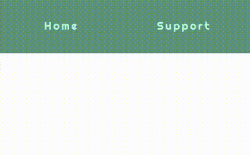

## Animated Navigation Bar WIP
A simple mock-up of a navigation bar, created for a self-directed collaborative project with some colleagues. This is a first pass at an animated navigation bar that conveys weight as the key element of design. The intention was to incorporate animations into the app's design that conveyed texture and weight. In this particular example the navigation hover effect was modeled after a water droplet.  

## Screenshots




## Built With
- [create-react-app](https://reactjs.org/)
- [svg2jsx.com](https://svg2jsx.com/)
- [Inkscape](https://inkscape.org/)

## How to use?
```
npm i 

npm start
```

## License

MIT © Tate Keller